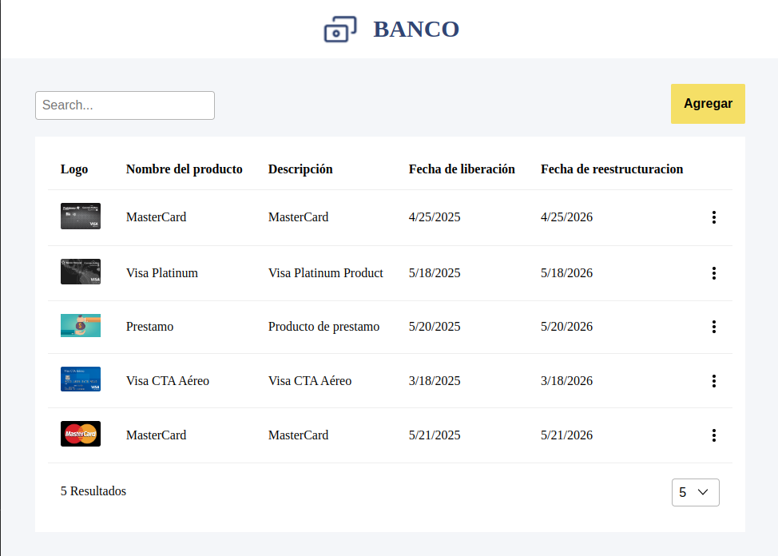
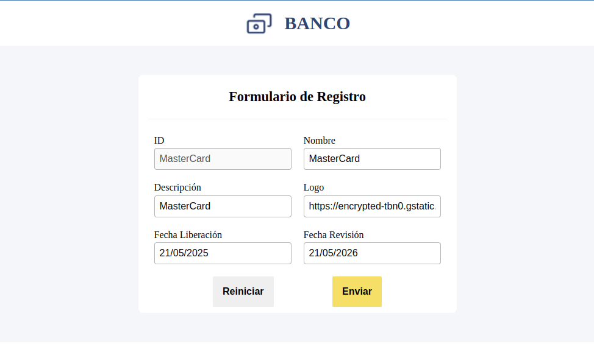

# **Bank Products**

> App that allows you to list, add, edit and delete a bank's products from an API

## About the Project

<p align="center">
  
  
</p>

This is a responsive and pure Angular based app. Pure means that it was done without the need to install other library than Angular.
Aditionally I used Angular 17.3.0 with the new Angular features like new sintax, signals, standalone components, etc...
Karma library was used to do the tests.

## **Technologies used for this project.**

[](https://html.spec.whatwg.org/multipage/)
[](https://www.css3.com/)
[](https://developer.mozilla.org/en-US/docs/Web/JavaScript)
[](https://www.typescriptlang.org/)
[](https://angular.io/)
[](https://sass-lang.com/)

### **How to start project**

## Install project dependecies:

```
npm install
```

## Start the web server

```
npm start
```

## Run tests

```
npm run test

